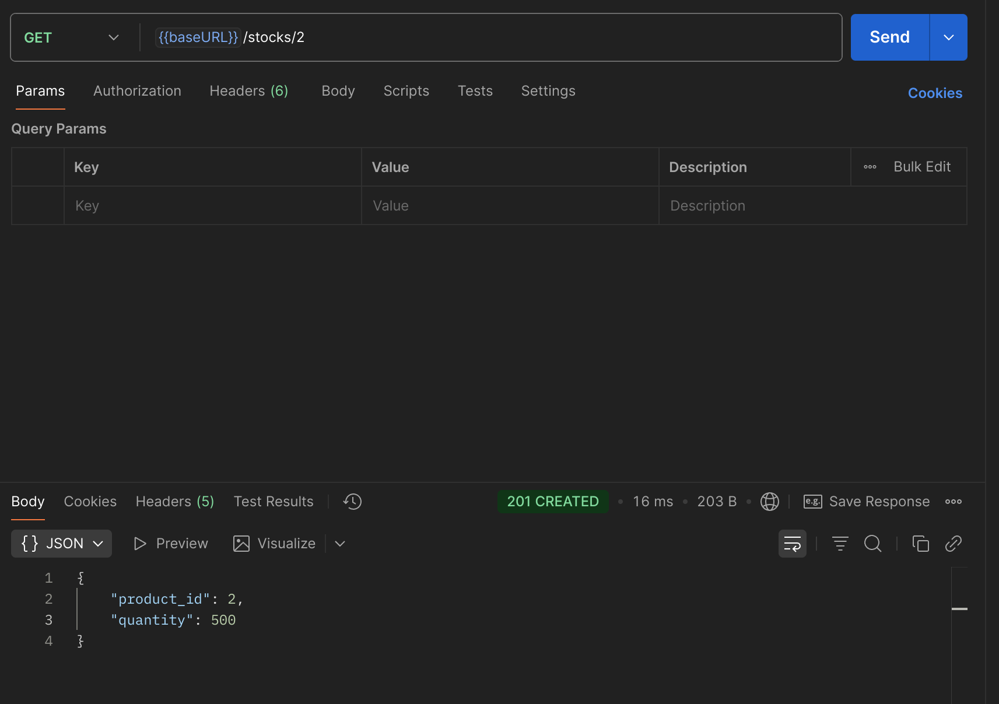
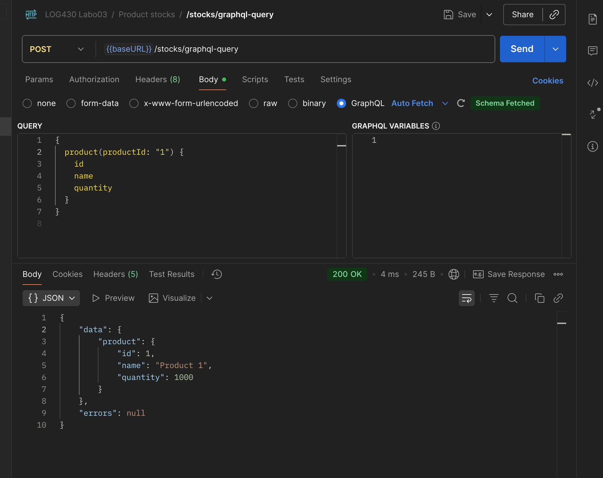
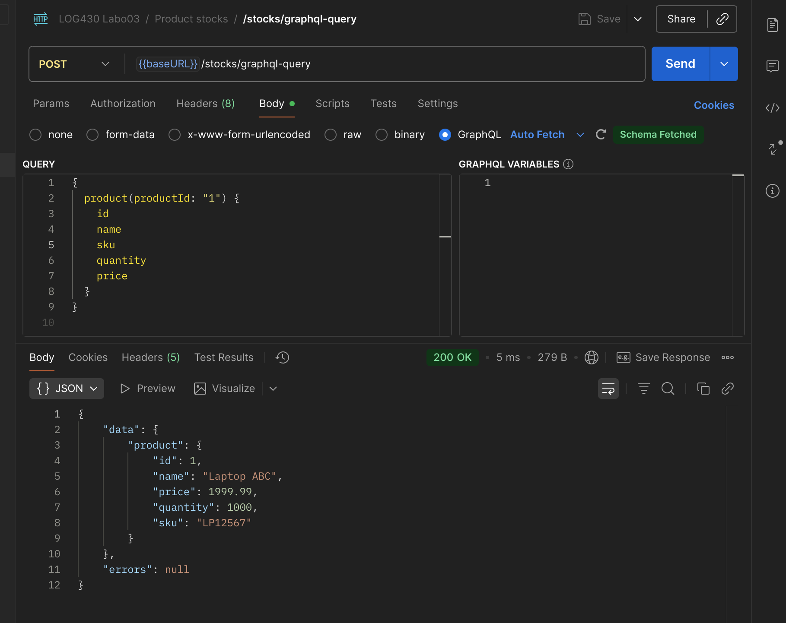
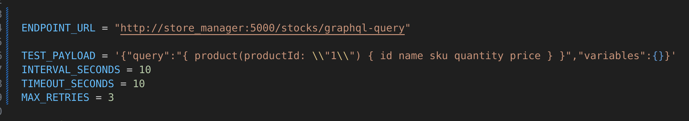
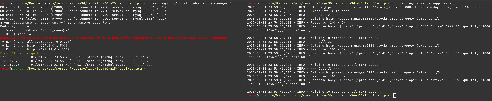
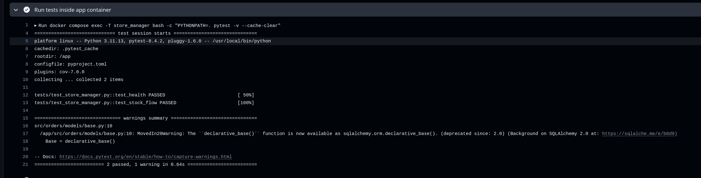
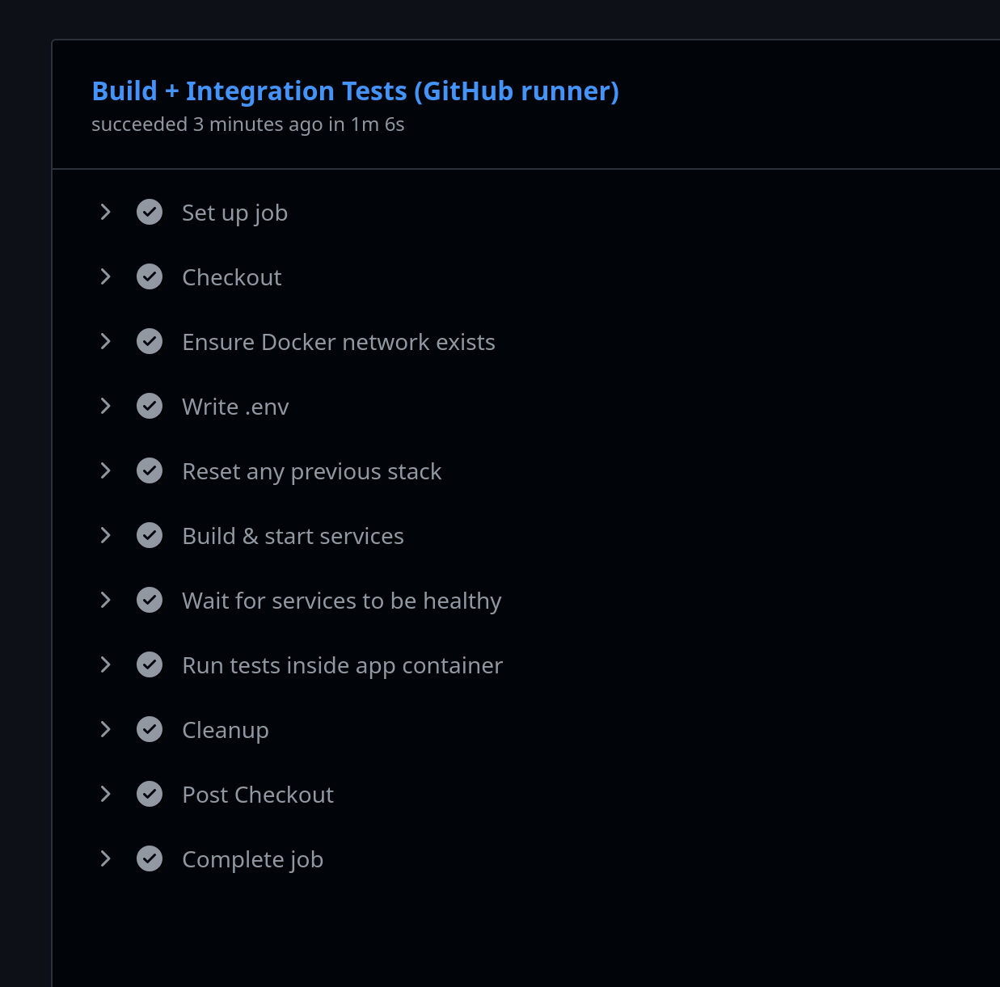
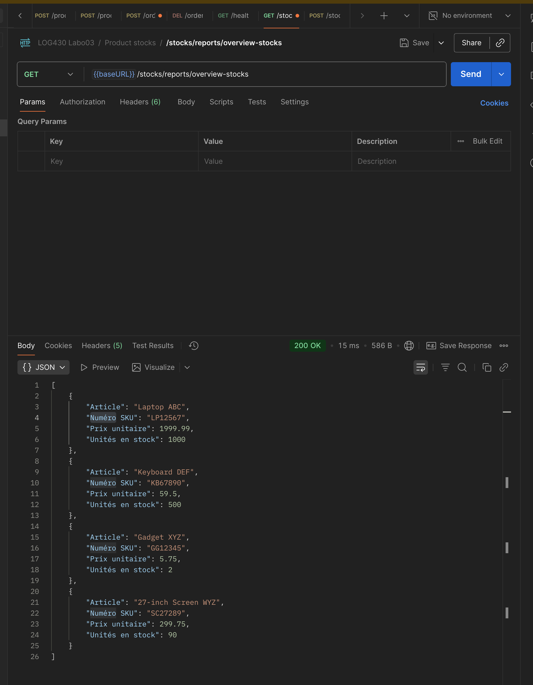

# Labo 02 — Rapport

 \
Felix-Antoine Legault \
Rapport de laboratoire \
LOG430 — Architecture logicielle \
Montreal, 3 octobre 2025 \
École de technologie supérieure

## Questions

### Question 1

Quel nombre d'unités de stock pour votre article avez-vous obtenu à la fin du test ? Et pour l'article avec id=2 ? Veuillez inclure la sortie de votre Postman pour illustrer votre réponse.

À la fin de la suite du Smoke Test, j'ai obtenu 5 unités de stock pour l'article créé durant le test. En effet, on créer un article avec une quantité initiale de 5, puis on crée une commande de 2 unités, ce qui réduit la quantité en stock à 3 unités. Ensuite, on supprime la commande, ce qui remet la quantité en stock à 5 unités.

Pour ce qui en est de l'article avec id=2, la quantité en stock est 500 unités.




### Question 2

Décrivez l'utilisation de la méthode join dans ce cas. Utilisez les méthodes telles que décrites à `Simple Relationship Joins` et `Joins to a Target with an ON Clause` dans la documentation SQLAlchemy pour ajouter les colonnes demandées dans cette activité. Veuillez inclure le code pour illustrer votre réponse.

Dans ce cas, la méthode join est utilisée pour effectuer une jointure entre les tables Stock et Product afin de récupérer des informations supplémentaires sur le produit associé à chaque stock. On utilise la clé étrangère product_id dans la table Stock pour faire la correspondance avec la clé primaire id dans la table Item. la méthode join est décrite dans la section `Joins to a Target with an ON Clause` de la documentation SQLAlchemy.

```python
def get_stock_for_all_products():
    """Get stock quantity for all products"""
    session = get_sqlalchemy_session()

    results = (
        session.query(
            Stock.product_id,
            Stock.quantity,
            Product.name,
            Product.sku,
            Product.price,
        )
        .join(Product, Stock.product_id == Product.id)
        .all()
    )

    stock_data = []
    for row in results:
        stock_data.append(
            {
                "Article": row.name,
                "Numéro SKU": row.sku,
                "Prix unitaire": float(row.price),
                "Unités en stock": int(row.quantity),
            }
        )

    return stock_data
```

### Question 3

Quels résultats avez-vous obtenus en utilisant l’endpoint `POST /stocks/graphql-query` avec la requête suggérée ? Veuillez joindre la sortie de votre requête dans Postman afin d’illustrer votre réponse.

Avec la requête suggérée, j'ai obtenu un produit qui s'appelle Product 1 avec une quantité de 1000.



### Question 4

Quelles lignes avez-vous changé dans `update_stock_redis`? Veuillez joindre du code afin d’illustrer votre réponse.

J'ai ajouté une ligne qui va chercher les infrmations du Product dans la bd SQL qui correspond au product_id du stock. Ensuite, j'ai modifié la ligne qui fait le hset pour ajouter les nouvelles colonnes name, sku et price. J'utilise le mapping du hset pour ajouter toutes les colonnes en une seule fois.

```python
def update_stock_redis(order_items, operation):
    """Update stock quantities in Redis"""
    if not order_items:
        return

    r = get_redis_conn()
    stock_keys = list(r.scan_iter("stock:*"))
    session = get_sqlalchemy_session()

    if stock_keys:
        pipeline = r.pipeline()
        for item in order_items:
            if hasattr(item, "product_id"):
                product_id = item.product_id
                quantity = item.quantity
            else:
                product_id = item["product_id"]
                quantity = item["quantity"]

            product = session.query(Product).filter(Product.id == product_id).first()

            current_stock = r.hget(f"stock:{product_id}", "quantity")
            current_stock = int(current_stock) if current_stock else 0

            if operation == "+":
                new_quantity = current_stock + quantity
            else:
                new_quantity = current_stock - quantity

            pipeline.hset(
                f"stock:{product_id}",
                mapping={
                    "quantity": new_quantity,
                    "name": product.name,
                    "sku": product.sku,
                    "price": product.price,
                },
            )

        pipeline.execute()
    else:
        _populate_redis_from_mysql(r)
```


### Question 5

Quels résultats avez-vous obtenus en utilisant l’endpoint `POST /stocks/graphql-query` avec les améliorations ? Veuillez joindre la sortie de votre requête dans Postman afin d’illustrer votre réponse.

Maintenant, on obtient les informations supplémentaires du produit, soit le nom, le sku et le prix. Le nom n'est plus Product {id}, mais bien son vrai nom.



### Question 6

Examinez attentivement le fichier `docker-compose.yml` du répertoire `scripts`, ainsi que celui situé à la racine du projet. Qu’ont-ils en commun ? Par quel mécanisme ces conteneurs peuvent-ils communiquer entre eux ? Veuillez joindre du code YML afin d’illustrer votre réponse.

Ils peuvent comminquer entre eux grâce au réseau créé avce la commande `docker network create labo03-network`. Ils peuvent donc se parler entre eux parce qu'on spécifie le réseau dans les deux fichiers docker-compose.yml avec ceci: 

```yml
networks:
  labo03-network:
    driver: bridgeh
    external: true
```

## Supplier App script

Pour faire fonctionner le supplier app script, j'ai dû modifier l'URL de l'API pour qu'elle pointe vers le bon endpoint (graphql -> graphql-query). J'ai aussi ajouté `sku quantity price` dans le corps de la rquête GraphQL pour obtenir les informations supplémentaires du produit. Voici une capture d'écran du changement et une capture des logs du conteneur qui montre que les rêquetes fonctionnent bien à partir du script.





## CI/CD

Le CI/CD est configuré avec GitHub Actions. Le workflow est déclenché à chaque push ou pull request vers la branche `main`. Il lance Redis et MySQL, puis lance les tests (voir plus bas une capture d'écran des tests). De plus, avec un self host runner sur la VM, il a une étape qui fait le déploiement en continu de l'application. On a donc une pipeline CI/CD qui test, build et déploie l'application automatiquement.




## Rapport de stock

Le rapport de stock est généré en appelant l'endpoint `/stocks/report` de l'API. Voici une capture d'écran du rapport généré:


## Tests 

Avec le smoke test, j'ai pu vérifier que les principales fonctionnalités de l'API fonctionnaient correctement. Voici le code du test: 

```python
def test_stock_flow(client: Flask):
    # 1. Créez un article (`POST /products`)
    product_data = {"name": "Some Item", "sku": "12345", "price": 99.90}
    response = client.post(
        "/products", data=json.dumps(product_data), content_type="application/json"
    )
    expected_status_code = 201

    assert (
        response.status_code == expected_status_code
    ), "1. `POST /products` wrong status code"
    data = response.get_json()
    assert data["product_id"] > 0

    # 2. Ajoutez 5 unités au stock de cet article (`POST /stocks`)
    product_id = data["product_id"]
    stock_quantity = 5
    stock_data = {"product_id": product_id, "quantity": stock_quantity}
    response = client.post(
        "/stocks", data=json.dumps(stock_data), content_type="application/json"
    )
    expected_status_code = 201

    assert (
        response.status_code == expected_status_code
    ), "2. `POST /stocks` wrong status code"
    data = response.get_json()
    assert f"rows added: {product_id}" in data["result"]

    # 3. Vérifiez le stock, votre article devra avoir 5 unités dans le stock (`GET /stocks/:id`)
    response = client.get(f"/stocks/{product_id}", content_type="application/json")
    expected_status_code = 201

    assert (
        response.status_code == expected_status_code
    ), "3. `GET /stocks/:id` wrong status code"
    data = response.get_json()
    assert stock_quantity == data["quantity"]

    # 4. Faites une commande de l'article que vous avez crée, 2 unités (`POST /orders`)
    order_quantity = 2
    product_data = {
        "user_id": 1,
        "items": [{"product_id": product_id, "quantity": order_quantity}],
    }
    response = client.post(
        "/orders", data=json.dumps(product_data), content_type="application/json"
    )
    expected_status_code = 201
    order_id = response.get_json()["order_id"]

    assert (
        response.status_code == expected_status_code
    ), "4. `POST /orders` wrong status code"

    # 5. Vérifiez le stock encore une fois (`GET /stocks/:id`)
    response = client.get(f"/stocks/{product_id}", content_type="application/json")
    expected_status_code = 201

    assert (
        response.status_code == expected_status_code
    ), "5. `GET /stocks/:id` wrong status code"
    data = response.get_json()
    assert stock_quantity - order_quantity == data["quantity"]

    # 6. Étape extra: supprimez la commande et vérifiez le stock de nouveau.
    # Le stock devrait augmenter après la suppression de la commande.
    response = client.delete(f"/orders/{order_id}")
    expected_status_code = 200

    assert (
        response.status_code == expected_status_code
    ), "6. `DELETE /orders/:id` wrong status code"
    data = response.get_json()
    assert data["deleted"]

    # Vérifiez le stock encore une fois (`GET /stocks/:id`)
    response = client.get(f"/stocks/{product_id}", content_type="application/json")
    expected_status_code = 201

    assert (
        response.status_code == expected_status_code
    ), "6. `GET /stocks/:id` wrong status code"
    data = response.get_json()
    assert stock_quantity == data["quantity"]
```
